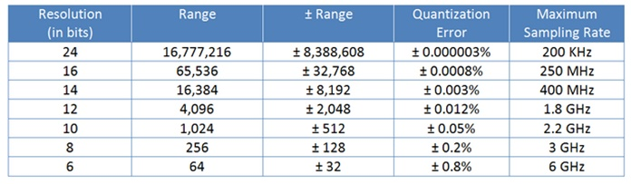

## Øvelser

### Øvelse 0 - Joystick og ADC

For at læse en joysticks position skal vi bruge en ADC (Analog to Digital Converter). ADC'en kan konvertere et analogt signal til et digitalt signal. ADC'en i vores mikrocontroller kan konvertere et signal mellem 0 og 3.3V til et heltal, så vi kan aflæse det i vores program.

Vores ESP32 har en ADC med en opløsning på 12 bit. Det betyder at den kan konvertere et signal til et heltal mellem 0 og 4095. 

I følgende tabel kan i se hvordan ADC'ens opløsning påvirker dens rækkevidde og sampling rate:



Rent kodemæssigt så er ADC via Micropython på ESP32 således:

```python
from machine import ADC, Pin

adc = ADC(Pin(34))         # lav ADC objekt på pin 34 
adc.read()                  # læs værdi, 0-4095 
```

1. Tilslut jeres joystick til jeres ESP32. I kan bruge følgende tabel til at se hvilke pins der skal bruges (konsulter jeres pinout diagram for at se hvilke der kan ADC):

| Joystick | ESP32 |
| :---: | :---: |
| GND | GND |
| +5V | 3V3 |
| VRx | ADC |
| VRy | ADC |
| SW | GPIO |

2. Programmer så i kan aflæse VRx og VRy (x og y akse positionen) via ADC.

3. Programmer så i kan aflæse SW (trykket på joystick) via GPIO. Her skal i instille Pin som pull up, for så er den by default 0. Dette gøres som i følgende eksempel:

```python
button = Pin(button_pin, Pin.IN, Pin.PULL_UP)
```

### Øvelse 1 - Find grænsepunkter

I skal bruge venste, højre, op og ned til at styre en motor. Så først find ud af hvilke værdier der skal til for at styre motoren i hver retning.

1. Sæt jeres aflæsninger fra øvelse 0 i et while loop, så i kan se hvad værdierne er når i bevæger joysticket. Skriv ned hvad den er når i ikke rykker på den, og hvad den er når i rykker den helt til venstre, højre, op og ned.

2. Lav print statements der gør at når i rykker joysticket til venstre, højre, op og ned, så printes retningen. 

### Øvelse 2 - Selvstudie

Nu skal i integrere servomotoren, så at når i ikke rører joystick, så er den i 0 graders position, og når i rykker den til venstre, højre, op og ned, så bevæger den sig til forskellige positioner. Dette er så en slags proof of concept, så i kan se at det virker til motorstyring. Vi skal bruge denne kode senere, så derfor er det vigtigt at i aflevere det så i kan få feedback på det, og så underviser lettere kan guide jer i den videre process. 
