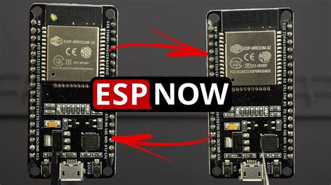

## Overblik



Espressif definerer ESP-NOW som en slags "forbindelsesløs" Wi-Fi-baseret kommunikationsprotokol. Det er en meget hurtig og pålidelig måde at sende data mellem ESP32-enheder på. Det er en slags "broadcast" protokol, hvor enhederne ikke behøver at være forbundet til et Wi-Fi-netværk, og hvor enhederne ikke behøver at kende hinandens IP-adresser. Det er derfor en meget nem måde at sende data mellem ESP32-enheder på.

Anvendelsesområderne spænder vidt, med alt fra smart home kommunikation, over fjernstyrede robotter, over over-the-air (OTA) opdateringer af ESP'er.

De eneste store ulemper er at det kun virker mellem ESP32-enheder, og ikke mellem ESP32 og andre enheder, samt at det kun virker over Wi-Fi (ikke Bluetooth).

## Eksempler

For at finde MAC-addressen på modtageren, hvilket skal anvendes når man sender:

```python
import network

wlan_sta = network.WLAN(network.STA_IF)
wlan_sta.active(True)

wlan_mac = wlan_sta.config('mac')
print("MAC Address:", wlan_mac)
```

### Receive

```python
import network
import espnow

# A WLAN interface must be active to send()/recv()
sta = network.WLAN(network.STA_IF)
sta.active(True)

e = espnow.ESPNow()
e.active(True)

while True:
    host, msg = e.recv()
    if msg:             # msg == None if timeout in recv()
        print(host, msg)
        if msg == b'end':
            break
```

### Send

```python
import network
import espnow
import time

sta = network.WLAN(network.STA_IF) # A WLAN interface must be active to send()/recv()
sta.active(True)

e = espnow.ESPNow()
e.active(True)
peer = b'\xbb\xbb\xbb\xbb'   # Replace with MAC address of peer's wifi interface
e.add_peer(peer)             # Must add_peer() before send()

e.send(peer, "Starting...")
for i in range(10):
    e.send(peer, "Are you listening?", True)
    time.sleep(2)
e.send(peer, b'end')
```
