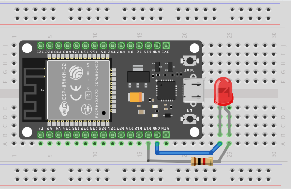

## Øvelser i standard 5mm LED'er

Ligesom vi i programmering har et ritual til første test ("Hello World"), så har vi i indlejrede systemer også et; *blinky*. Blinky handler om at vi kan styre (blinke) en LED med 2 elementer:

1. Et program på en mikrocontroller
2. Et kredsløb med en (eller flere) LED

Når vi skal konstruere et sådant system, plejer vi at starte med at sætte kredsløb op, og derefter programmere mikrocontrolleren for at styre komponenterne.

1. Vi starter med at sætte kredsløbet op. Det kan illustreres som følger:



2. Alternativt i tabelform:

    | ESP32 pin | Rød LED |
    |--- | --- |
    | GPIO 13 | Anode + (langt ben) via 91 ohm modstand |
    | GND | Cathode - (kort ben) |

3. Vi skal så overføre koden via Thonny til ESP32. Koden er som følger:

```python
from machine import Pin
from time import sleep

led = Pin(5, Pin.OUT)

while True:
    led.value(1)
    sleep(0.5)
```

4. Koden tænder bare LED'en. Prøv på en linje under `sleep(0.5)` at tilføje `led.value(0)`, og kør koden igen. Hvad sker der så?

### Øvelse 2 - Modstand og anden kontrol

1. Prøv at sætte en større modstand til LED'en. Hvad sker der så? Hvorfor tror du at en større modstand påvirker LED'en sådan?

2. Prøv at fjerne modstanden fra kredsløbet, altså sæt det lange ben direkte til ESP32 GPIO 5, og kør jeres kode igen. Hvordan påvirker det lyset?

2. Prøv at sætte `sleep(0.5)` højere, og derefter lavere end 0.5. Forklar hvad du ser.

### Øvelse 3 - Morseblink

Dette er en øvelse til selvstudie (anbefales at gøre i jeres studiegruppe) og en opgave til næste gang. 

Morsekode er i princippet et alfabet som vi kan bruge til at kommunikere via lys. Måske har i set det i film, eller prøvet det i skolen, f.eks. med en lommelygte. F.eks. er bogstavet "a" et hurtigt blink, efterfulgt af et langt blink. Det kunne måske redde os i en nødsituation, men det kræver at vi ved hvordan vi skriver "SOS" med lys.

1. Oversæt SOS til morse - f.eks. ved brug af en [oversætter](https://morsecode.world/international/translator.html).
2. Ændre i koden så at i tænder og slukker LED'en så den siger SOS i Morse.

## Øvelser i RGB LED'er

### Øvelse 1 - PWM lysstyring

Vi skal til at bruge PWM til at styre lysstyrken på vores LED. Det gør vi ved at ændre på duty cycle. Duty cycle er hvor meget af tiden signalet er højt. Hvis vi har et signal der er højt 50% af tiden, så er duty cycle 50%. Hvis vi har et signal der er højt 10% af tiden, så er duty cycle 10%. Procenten svarer også til spændingen, så f.eks. hvis indgangsspændingen er 5V, og duty cycle er 20%, så er udgangsspændingen 1V.

I kan læse mere og finde basiskode på [UCL ITT Guides](https://eal-itt.gitlab.io/ucl-itt-guides/docs/pwm)

Det i skal gøre er at finde koden og teste det med jeres LED.

### Øvelse 2 - PWM til specifik lysstyrke og fade

Vi skal nu til at bruge PWM til at styre lysstyrken på vores LED. Det gør vi ved at ændre på duty cycle.

Tag udgangspunkt i følgende kode:

```python
from machine import Pin, PWM

led = PWM(Pin(23), freq=5000, duty=500)
```

Opgaven er så at skifte duty cycle i 10 trin, svarende til 10% til 100% i 10% intervaller. Husk at duty cycle går fra 0 til 1023.

### Øvelse 3 - Gruppeopgave PWM lysstyring - RGB

Vi skal nu til at styre en RGB LED. Det gør vi ved at bruge 3 PWM signaler - en til rød, en til grøn, og en til blå. 

Hver gruppe låner en RGB LED fra laboratoriet. 

I skal forbinde som på billedet under. Det er 470 ohm resistorer vi bruger til alle ben nu (kan også findes i laboratoriet).


I kan tage udganspunkt i nedenstående kode:

```python
from machine import Pin, PWM

red = PWM(Pin(23), freq=5000, duty=500)
green = PWM(Pin(22), freq=5000, duty=500)
blue = PWM(Pin(21), freq=5000, duty=500)
```

Siden vi har sat duty til det samme (svarende til ca. 50%) til hver farve, er det som at ligeligt at blande alle 3 farver. I kan prøve at ændre på duty for hver farve og se hvad der sker.

Opgaven til næste gang, er dog at tag i alle i gruppen vælger en yndlingsfarve. I skal så programmere jeres ESP32 så den blinker mellem alle jeres yndlingsfarver.

I kan bruge en color picker til at finde den værdi i har brug for: [link til color picker](https://www.w3schools.com/colors/colors_picker.asp).
Her skal i bruge RGB værdierne. Hvis i placere dem ind som nye duty værdier, så får i den farve i efterspørger.
