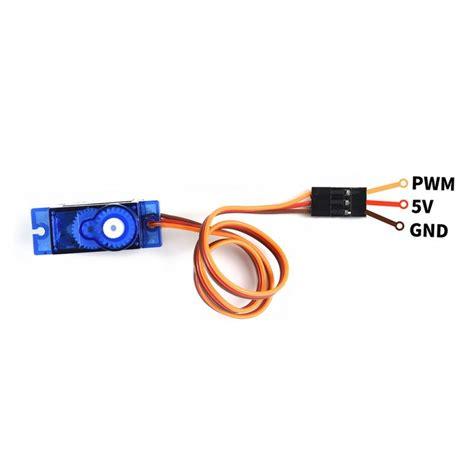
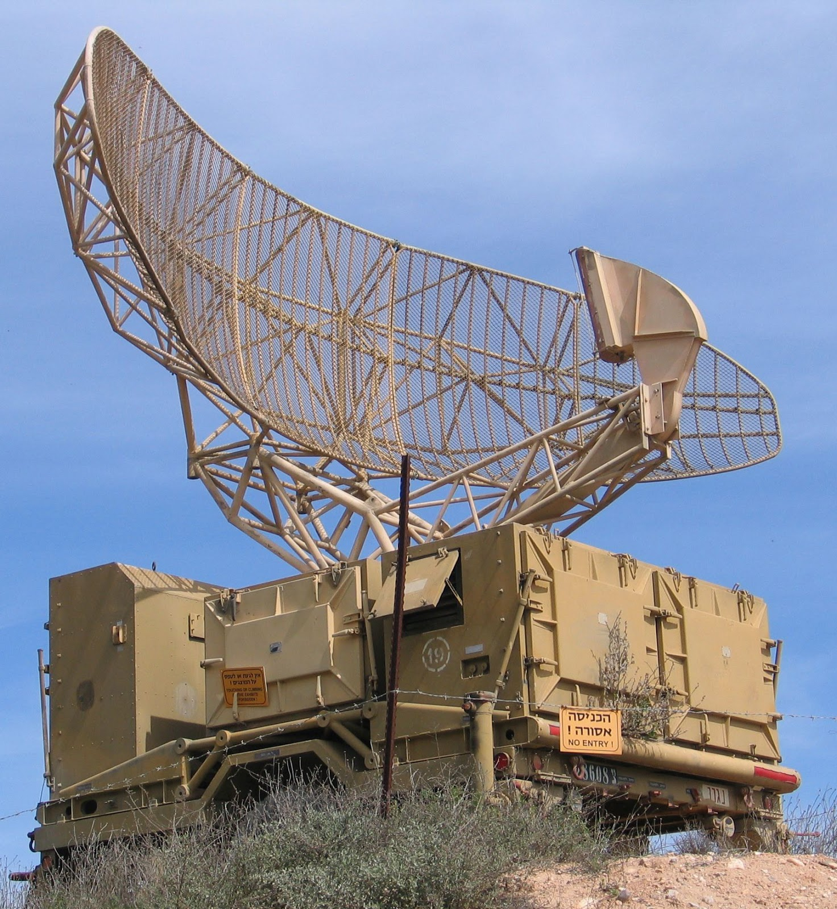

## Hvad er PWM?

PWM står for pulse-width modulation (pulsbreddemodulation på dansk). Det er en teknik der bliver brugt meget i motorstyring, lysstyring og lyd. 

Ret basalt fungere PWM sådan at vi "pulser" elektricitet i stedet for at give det 100% af tiden. På den måde kan vi f.eks. styre hvor hurtigt en motor roterer og hvor lys en pære er. 

Det kan f.eks. illustreres som følger:


Dette er et ekempel på et Pulsbreddemodulation (PWM) signal med varierende arbejdscyklus (duty cycle = D; 10% trin) og fast periodetid.

Vi kan oversætte duty cycle til spænding. Se følgende billede:


Så det der sker her, er at vi med trinene justere 10% ad gangen, og dvs. at vi kan variere hvor meget af tiden vi sender strøm igennem. Vi kan selv indstille PWM til at den tilføre strøm i 10% af tiden, 20% af tiden, 30% af tiden osv. Når vi gør det i små nok bidder, f.eks. i milisekunder, så kan vi f.eks. med en LED få den til at lyse svagere eller kraftigere. Det sker ved at den faktisk blinker! Ved 10% duty cycle er den kun tændt i 10% af den tid vi vælger at skære bidderne op i. Så hvis vi vælger perioden til at være 10 milisekunder, så lyser den i 1 milisekund hver 10. milisekund. Derfor blinker den, men så hurtigt at vi ikke kan se det. Det vil bare føles meget svagere end hvis den var tændt hele tiden.

## PWM til LED på ESP32 med MicroPython

ESP32 har mange pins der kan bruges til at sende PWM signaler ud. Faktisk kan en ESP32 styre 16 PWM signaler uafhængige af hinanden. Find en af dem, f.eks. ved at kigge på en pinout:


Når du har valgt en pin, kan du koble en LED til, og så kan du bruge følgende kode til at sende PWM ud på den:

```python
from machine import Pin, PWM
from time import sleep

frequency = 5000
led = PWM(Pin(5), frequency)

for duty_cycle in range(0, 1024):
    led.duty(duty_cycle)
    sleep(0.005)
```

## PWM til servostyring

Analoge servomotorer bruger PWM til at styre motorakslens position. 

PWM-signalet er normalt omkring 50 Hz, hvilket er en periode på 20 ms. Inden for den periode varieres pulsbredden, en kortere puls positionerer servoen mod nul-gradersmærket, mens en længere bevæger motorakslen mod 180 (eller 270) graders position.

Pulsen tilføres hele tiden til motorens kontrolinputs og låser akslen i den ønskede position.

Denne effekt er illustreret som følger:


## PWM til DC Motorstyring

DC motorer kan også styres med PWM. I stedet for at styre positionen, styrer vi hastigheden. Grunden til at PWM virker med DC motorer er ikke den samme som med LED'er, for vi justere ikke hastigheden i små milisekunder. Det er dog sådan at når vi vælger at sende ud halvdelen af tiden f.eks., så er der faktisk et lille øjeblik hvor strømmen er slukket. Det er nok til at DC motoren bremser lidt, og derfor kan vi styre hastigheden. 

Rent teknisk set, så er en DC motor for langsom til at reagere på at vi slukker i meget kort tid til at den vil stoppe. Dette kan dog indstilles. Det kan læses mere om hos Adafruit: [link til artikel om PWM frekvens](https://learn.adafruit.com/improve-brushed-dc-motor-performance/pwm-frequency).

Adafruit har en god artikel der går lidt mere i dybden om hvordan duty cycle påvirker spændingen der går til en DC motor: [Adafruit link til DC motor duty cycle](https://learn.adafruit.com/improve-brushed-dc-motor-performance/duty-cycle).

## Øvelser i PWM 

### Øvelse 0 - Servokalibrering

Vi bruger vores blå servoer i kittet i dag. Herunder er et billede og wiring for den blå servo:



Problemet er nu at en servo reagerer lidt anderledes på PWM end LED'er. I kan læse om indstillinger, og se et diagram der viser hvordan den roterer baseret på duty cycle under afsnittet `PWM til servostyring` ovenfor.

Det vi skal nu, er at kalibrere koden så den passer til vores servo. Det gør vi ved at lave en funktion der tager en vinkel som parameter, og så beregner den duty cycle der skal til for at rotere til den vinkel. Bemærk at der kan være forskel på hvor langt den roterer, så det er ikke sikkert at den roterer 180 grader. Dette er det i skal kalibrere - hvilken niveau af duty passer til hvilken vinkel.

Nedskriv hvilen niveau af duty der svarer til 0 grader, 90 grader og 180 grader.

### Øvelse 1 - Servostyret "radar"

Nu skal vi bruge servomotorer til at lave en "radar"... som egentlig er sonar.

Sådan en her:



I meget mindre skala, og med sonar. Så vi skal bruge vores servo, sammen med vores HC-SR04 sonar, og et 3D print jeg har printet til jer. Det er en holder til sonaren, så den kan sidde på en servo.

Så vi skal bruge vores servo samt koden fra øvelse 0. Servoen skal hele tiden, langsomt, dreje fra side til side. Hver gang den har drejet 10 grader, skal den stoppe og måle afstanden med sonaren. Den skal så gemme afstanden i en liste, og så fortsætte med at dreje. Når den har drejet 180 grader, skal den så dreje tilbage igen, og måle afstande på samme måde. Dette skal laves til næste gang.

Sonar pin-tabel:

|Sonar | ESP32|
|:---:|:---:|
|VCC|VIN|
|GND|GND|
|TRIG|GPIO 5|
|ECHO|GPIO 18|

Basiskode (copy paste til Thonny og gem på ESP32):

```python
import machine, time
from machine import Pin

class HCSR04:
    def __init__(self, trigger_pin, echo_pin, echo_timeout_us=500*2*30):
        self.echo_timeout_us = echo_timeout_us
        self.trigger = Pin(trigger_pin, mode=Pin.OUT, pull=None)
        self.trigger.value(0)

        self.echo = Pin(echo_pin, mode=Pin.IN, pull=None)

    def _send_pulse_and_wait(self):
        self.trigger.value(0) # Stabilize the sensor
        time.sleep_us(5)
        self.trigger.value(1)
        time.sleep_us(10)
        self.trigger.value(0)
        try:
            pulse_time = machine.time_pulse_us(self.echo, 1, self.echo_timeout_us)
            return pulse_time
        except OSError as ex:
            if ex.args[0] == 110: # 110 = ETIMEDOUT
                raise OSError('Out of range')
            raise ex

    def distance_mm(self):
        pulse_time = self._send_pulse_and_wait()
        mm = pulse_time * 100 // 582
        return mm

    def distance_cm(self):
        pulse_time = self._send_pulse_and_wait()
        cms = (pulse_time / 2) / 29.1
        return cms
```

Få distance som centimeter (andet kode i lægger på):

```python
from hcsr04 import HCSR04
from time import sleep

sensor = HCSR04(trigger_pin=5, echo_pin=18, echo_timeout_us=10000)

while True:
    distance = sensor.distance_cm()
    print('Distance:', distance, 'cm')
    sleep(1)
```
