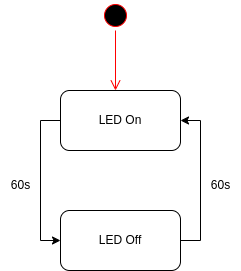

## State Machine

En state machine har en række forskellige states, som den kan være i. Den kan skifte state, hvis der opfyldes et krav. Dette krav kan være en bestemt tid, en bestemt værdi eller noget helt tredje.

Som et første simpelt eksempel har vi en LED som har 2 states: Tændt og slukket. Den skifter state hvert minut. Dette kan illustreres med følgende state diagram:



Vi kan implementere dette i Python med følgende kode:

```python
# State machine klasse eksempel
# Lav en state machine klasse
class StateMachine:
    # Definer states
    def __init__(self):
        self.states = ['on', 'off']
        self.current_state = self.states[0] # Start state er første state i listen

    # Skift state
    def change_state(self):
        if self.current_state == self.states[0]:
            self.current_state = self.states[1]
        else:
            self.current_state = self.states[0]

    # Print state
    def print_state(self):
        print(self.current_state)
```

Vi kan nu lave en instans af vores state machine og køre den:

```python
# Lav en instans af state machine
led = StateMachine()

# Print state
led.print_state()

# Skift state
led.change_state()

# Print state
led.print_state()
```
